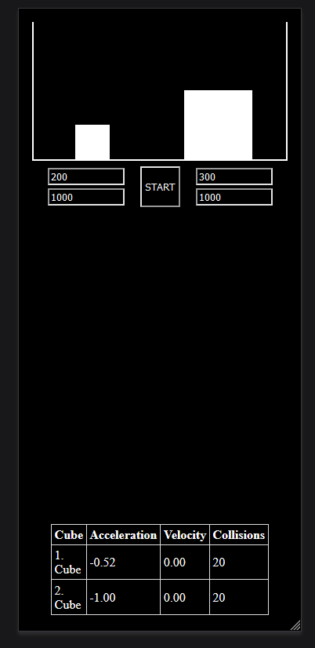

# Simulate App

## Description

The Simulate App is a simple simulation application that allows you to simulate the behavior of two cubes with different masses and forces in a controlled environment. It provides a visual representation of the cubes' movement and collision events.

## Screenshots

Vertical Orientation:


Horizontal Orientation:

## Features

- Simulate the motion of two cubes.
- Adjust the mass and force of each cube.
- Visual representation of cube movement and collisions.
- Start and stop the simulation.

## Installation

To run the app, you need to have Angular installed. If you don't have it, you can install it using the following command:

```bash
npm install -g @angular/cli
```

After installing Angular, navigate to the project directory and run the app:
```bash
ng serve
```

The app will be available at `http://localhost:4200/` by default.

## Usage
1.    Adjust the mass and force values for both cubes in the input fields.
2.    Click the "Start" button to initiate the simulation.
3.    Observe the movement and collisions of the cubes in the SVG display.
4.    Click the "Start" again button to end the simulation.

## Contributing
Contributions are welcome! If you would like to contribute to the Simulate App, please open an issue or submit a pull request.